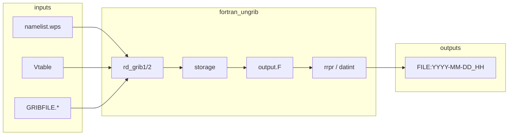

# Python ungrib (`ungrib/py`)

This directory contains a modern Python reimplementation of the WPS **ungrib** program, designed for **parallel I/O** over input GRIB files and clearer structure than the legacy Fortran stack in `ungrib/src/`.

## How the original Fortran ungrib is organized

The classic ungrib executable is driven by `ungrib.F` and supporting modules under `ungrib/src/`. At a high level:

| Area | Role |
|------|------|
| **`ungrib.F`** | Main program: loops over `GRIBFILE.AAA`, `GRIBFILE.AAB`, … reads GRIB records, fills per-timestep storage, calls `output`, then runs post-pass steps (`rrpr`, `datint`, `file_delete`). |
| **`read_namelist.F`** | Reads `namelist.wps` (`&share`, `&ungrib`): simulation window, `interval_seconds`, `prefix`, `out_format`, `ordered_by_date`, optional level interpolation (`add_lvls`, `new_plvl`, …). |
| **`parse_table.F`**, **`table.F`** | Reads the **`Vtable`** file: maps GRIB (GRIB1 or GRIB2) metadata to WPS field names, units, descriptions, and output priorities. |
| **`rd_grib1.F`**, **`rd_grib2.F`** | Decode one GRIB message at a time; match against the Vtable; populate `gridinfo` and `storage_module`. |
| **`gridinfo.F`** | Map projection metadata (`map%igrid`, `nx`, `ny`, corners, `dx`/`dy`, earth radius, grid-relative winds). |
| **`output.F`** | Writes **WPS intermediate format** (version **5** when `out_format = 'WPS'`): unformatted sequential Fortran records consumed by **metgrid**. |
| **`rrpr.F`**, **`datint.F`**, **`file_delete.F`** | Second pass and temporal filling; cleanup of temporary `PFILE:` data. |
| **`Variable_Tables/`** | Example Vtables (`Vtable.GFS`, …) shipped with WPS. |
| **`src/ngl/`** | NCEP GRIB1/GRIB2 library (w3, g2, …) used by the Fortran reader. |

Data flow (conceptual):



## This Python package (`ungrib_py`)

- **Parallelism**: Each worker processes one **GRIB input file** (`GRIBFILE.*`). Results are merged by **validity time** in the parent process, then **one intermediate file per timestep** is written (same naming pattern as Fortran: `prefix:YYYY-MM-DD_HH` for hourly data).
- **GRIB decoding**: **GRIB Edition 2** via **ecCodes** (`pip install eccodes`). GRIB1 is not implemented here yet.
- **Parity**: The Fortran tool’s full behavior (all projections, soil-level corner cases, `rrpr`, `datint`, EC non-standard record lengths, etc.) is large. This port focuses on a **maintainable core**: Vtable-driven GRIB2 extraction and WPS intermediate version **5** output for common grids.

See **`MIGRATION.md`** for the staged migration plan, testing instructions, and known gaps.

## Quick start (same idea as `ungrib.exe`)

You do **not** need a virtual environment or **`PYTHONPATH`** if you run the top-level launcher script **`ungrib.py`**. That script lives next to the `ungrib_py` package and prepends its directory to `sys.path`, so it works when **symlinked** into your WPS run directory—like linking the old compiled binary.

**1. Install Python dependencies once** (system Python 3.10+ is fine; use `--user` if you prefer not to touch the system site-packages):

```bash
pip install --user -r /path/to/WPS/ungrib/py/requirements.txt
```

You may need OS packages for ecCodes (e.g. `libeccodes-dev` on Debian/Ubuntu) before `pip install eccodes` succeeds.

**2. Link the launcher into your working directory** (same pattern as `ln -s .../ungrib.exe .`):

```bash
ln -sf /path/to/WPS/ungrib/py/ungrib.py ./ungrib.py
chmod +x ./ungrib.py
```

**3. Run it** from that directory (where `namelist.wps`, `Vtable`, and `GRIBFILE.*` live):

```bash
./ungrib.py --help
./ungrib.py --workers 16
```

Alternatively, call the interpreter explicitly (no execute bit needed):

```bash
python3 /path/to/WPS/ungrib/py/ungrib.py --workers 16
```

**Optional:** `pip install /path/to/WPS/ungrib/py` installs the `ungrib-py` console entry point on your `PATH`; then you do not need a symlink (but the symlink matches the old `ungrib.exe` workflow).

Expect `Vtable` and `namelist.wps` in the current working directory (same convention as Fortran ungrib). Input files must follow `GRIBFILE.AAA`, `GRIBFILE.AAB`, … naming.

## Layout of `ungrib/py`

| Path | Purpose |
|------|---------|
| `ungrib.py` | Launcher: sets `sys.path` and runs the CLI (symlink this like the old `ungrib.exe`). |
| `ungrib_py/vtable.py` | Parse WPS Vtable (GRIB2 columns). |
| `ungrib_py/grib2.py` | Scan messages with ecCodes; match Vtable; compute WPS level codes. |
| `ungrib_py/intermediate.py` | Write WPS intermediate format version 5 (Fortran unformatted records). |
| `ungrib_py/namelist_wps.py` | Minimal `namelist.wps` reader (`&share`, `&ungrib`). |
| `ungrib_py/parallel_ungrib.py` | Process pool over GRIB files; merge; write outputs. |
| `ungrib_py/cli.py` | Command-line entry point. |
| `tests/` | Unit tests (no GRIB fixture required for most tests). |
